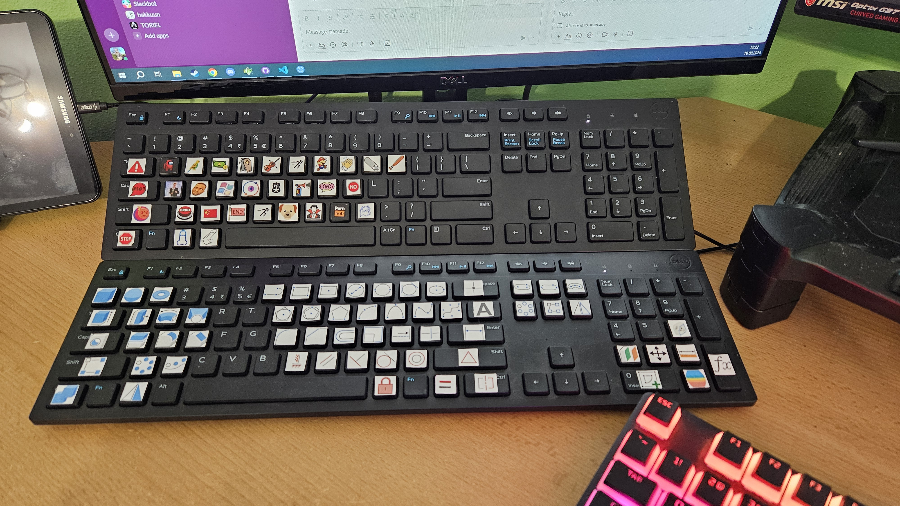
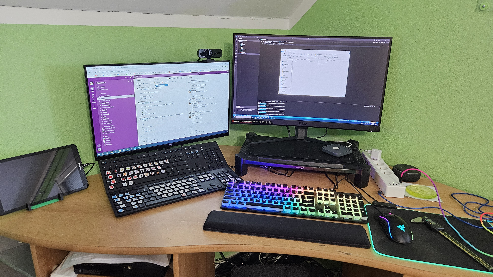
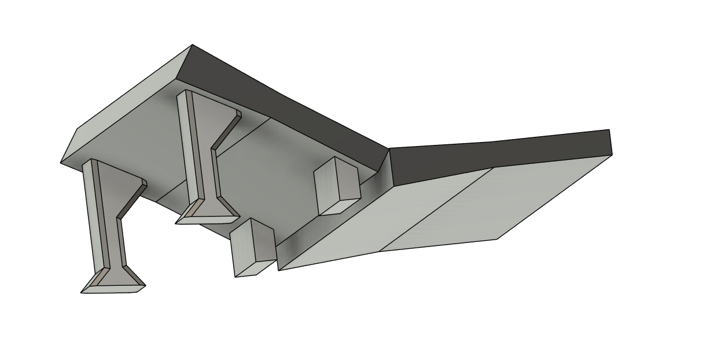

# Macro-Keyboards

Made as part of Arcade Hack Club.
Used github copilot when wrting readme.

I wanted to make a cheap macro pad with a lot of buttons, that can be easily programmed and used for various tasks.
I came across the [AutoHotInterception](https://github.com/evilC/AutoHotInterception) library for [AutoHotKey](https://github.com/AutoHotkey/AutoHotkey), which allows windows to differentiate between different keyboards.

I used two Dell KB-216 keyboards, because the keycaps are flat, allowing me to easily add icons/lables to the keys.
I turned the bottom keyboard into a Fusion360 shortcut keyboard.
And the top one into a universal soundboard using [EXP Soundboard](https://github.com/judge2020/EXP-soundboard) and [VB Virtual Audio Cable](https://vb-audio.com/Cable/VirtualCables.htm).

I printed legs to raise the top keyboard, and added felt pads to prevent it from sliding around.

## Code

The code consists of two functions, one for each keyboard.
Each key coppressponds to a key code that is intercepted and translated into a macro combination.

## Usage

Install [AutoHotKey](https://github.com/AutoHotkey/AutoHotkey) and [AutoHotInterception](https://github.com/evilC/AutoHotInterception)
Edit the Macro.ahk file to your liking.
Change you shortucts in your target program to the ones you set in the script.
Run the script by double clicking it.

